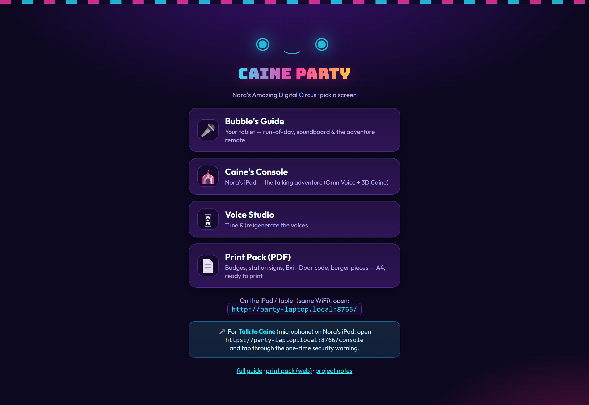
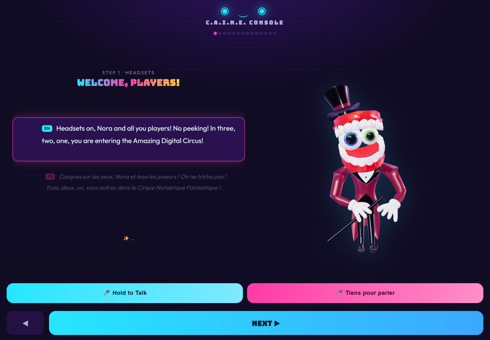
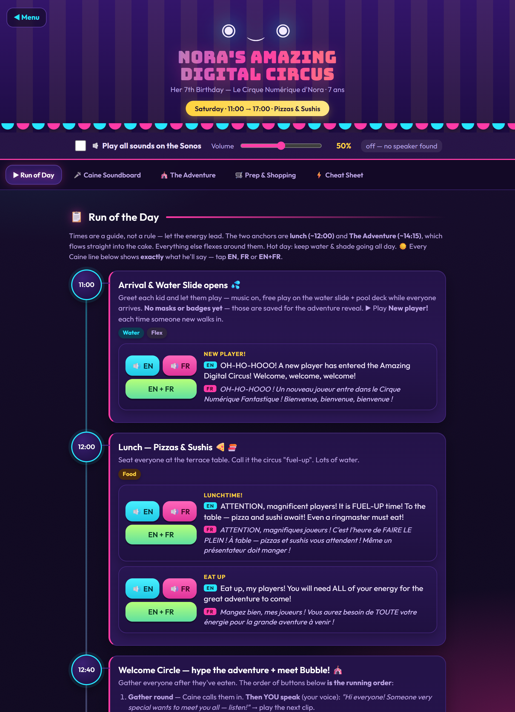
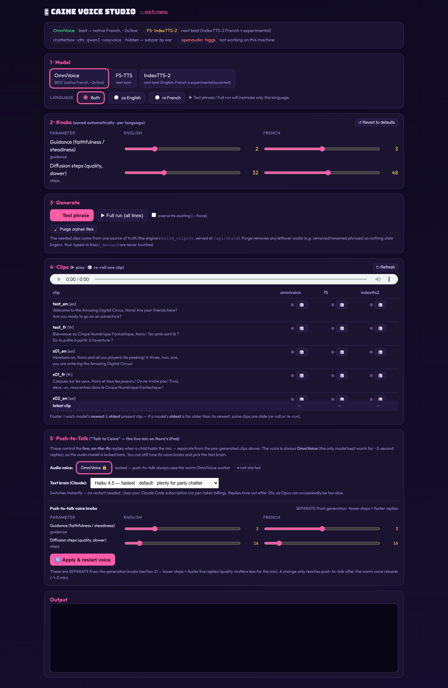
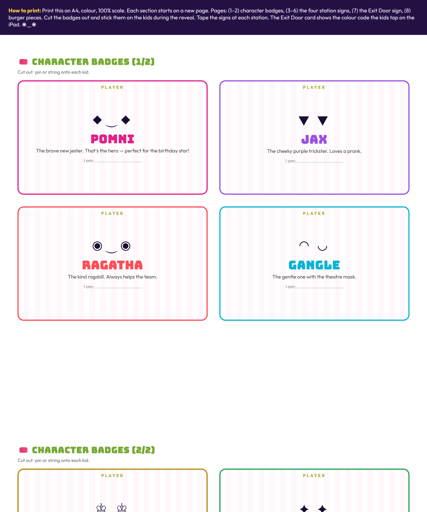

# 🎪 Amazing Digital Circus — Birthday Party App

> A complete, self-hosted kit to throw an **Amazing Digital Circus**-themed kids' birthday
> party where **Caine**, the AI ringmaster, hosts the whole event **in his own cloned voice** —
> on an iPad, with a **real-time 3D Caine**, **bilingual (English 🇬🇧 / French 🇫🇷) narration**,
> **push-to-talk live conversation**, a parent's run-of-day guide, a printable pack, and a tiny
> local server that ties it all together.

It was built for one child's 7th birthday and has been **fully anonymized** (names, network,
home details) so you can fork it and adapt it for your own party. It runs **entirely on your own
laptop over your home Wi-Fi** — no cloud account required for the core experience.

> **Unofficial fan project.** *The Amazing Digital Circus* and its characters are © **Gooseworx /
> Glitch Productions**. This project is not affiliated with or endorsed by them. See
> [CREDITS.md](CREDITS.md) and [LICENSE](LICENSE). For **personal, non-commercial** use.

---

## ✨ The tour

### 1 · The hub — one app, four screens
Start the server and open it on the party laptop. Everything lives behind one address.



### 2 · Caine's Console (the iPad) — 3D Caine + the talking adventure + push-to-talk
A full-screen iPad app. A **live 3D Caine** narrates every step **in his cloned voice**, English
then French. You (playing "Bubble", Caine's real-world helper) press **NEXT** to move the
adventure along. The kids can **hold to talk** and Caine answers back, live, in his own voice.



### 3 · Bubble's Guide (your tablet) — run-of-day, soundboard, adventure remote
Your control room for the day: a minute-by-minute run sheet, a soundboard of Caine one-liners,
the full adventure script, prep/shopping lists, and a **remote that drives the iPad**. Includes
an optional **Sonos** toggle so Caine booms through your speakers.



### 4 · Voice Studio — clone & (re)generate Caine's voice
Pick a voice model, tune the knobs, choose the language(s), and **(re)generate all of Caine's
lines** personalised with the kids' names. Separate, faster knobs power the live "Talk to Caine".



### 5 · Print Pack — badges, signs, exit-door code, props
A print-ready A4 pack: per-character badges, station signs, the Exit-Door colour code, and
burger-assembly pieces. Also available as a one-click PDF.



---

## 🎁 What it does

| Capability | How |
|---|---|
| 🎙️ **Voice-cloned ringmaster** | Clones Caine's voice from a short reference clip and speaks every line, EN + FR. |
| 🧒 **Personalised** | Bakes each child's name + chosen character into the lines ("Happy birthday, &lt;name&gt;!"). |
| 🟦 **3D Caine** | A real-time 3D model (three.js) lip-syncs/poses on the iPad console. |
| 🗣️ **Talk to Caine** | Push-to-talk: kids speak, Claude writes Caine's reply, it's spoken back in his voice (~2s). |
| 🗺️ **Guided adventure** | A 45-min "Gather the Gloinks" quest, narrated step-by-step; you just press NEXT. |
| 🇬🇧🇫🇷 **Bilingual** | Every line in English and French. |
| 🔊 **Sonos** | Optional: play Caine through a Sonos speaker on the same network. |
| 🖨️ **Printables** | Badges, signs, exit code, cue cards — A4, ready to print. |

---

## 🧩 Components

```
caine-console/     The iPad app: 3D Caine + step-by-step talking adventure + push-to-talk
caine-voice/       The engine + the local "Party Server" (serves the guide/console/studio,
                   voice generation, Talk-to-Caine, Sonos). This is the heart of the app.
Nora-Circus-Party-Guide.html   Bubble's run-of-day guide (served at /guide)
Circus-Print-Pack.html/.pdf    The printable pack
caine-host-phrases.js          Caine's soundboard one-liners (EN/FR)
caine-terminal/    A tiny legacy "tap-the-colours" web page (the simple standalone version)
characters/        Character art (source assets)
venue/             (optional, private) drop your own photos + floor plan here — see venue/README.md
Start Caine Party.bat          Double-click launcher (Windows)
```

The detailed engineering notes live in [Agent.md](Agent.md) and [caine-voice/README.md](caine-voice/README.md).

---

## 🚀 Quick start

**You need:** Windows with [Python 3.10+](https://www.python.org/) (the `py` launcher), a modern
browser, and an **iPad/tablet + your laptop on the same Wi-Fi**. A CUDA **GPU is strongly
recommended** for voice generation (CPU works but is slow). The **OmniVoice** voice I used needs
**no API token** (only a few optional, gated models do).

1. **Get the code**
   ```bash
   git clone https://github.com/mayerwin/Amazing-Digital-Circus-Birthday-Party-App.git
   cd Amazing-Digital-Circus-Birthday-Party-App
   ```
2. **(Optional) secrets** — only needed for a few *gated* Hugging Face voices:
   ```bash
   cp SECRETS.env.example SECRETS.env   # then paste your HF token
   ```
3. **Start the Party Server** — double-click **`Start Caine Party.bat`**, or:
   ```bash
   cd caine-voice
   py caine_studio_web.py
   ```
   It prints the exact addresses to open. By default:
   - Laptop hub: `http://localhost:8765/`
   - iPad / tablet (same Wi-Fi): `http://<your-laptop-ip>:8765/`
   - 🎤 "Talk to Caine" (microphone needs HTTPS): `https://<your-laptop-ip>:8766/console`
     (accept the one-time self-signed-cert warning).
   > Tip: when Windows asks, **allow access on Private networks** so the iPad can connect.

4. **Open the screens**: `/console` on the iPad, `/guide` on your tablet, `/studio` on the laptop.

5. **Generate Caine's voice** → open **Voice Studio** (`/studio`), pick a model
   (**OmniVoice** is the one I used; IndexTTS-2 and F5-TTS were the other shortlisted),
   choose language(s), and hit **Full run**. The first run
   downloads the model and builds an isolated environment automatically (multi-GB, one-time).
   Until you do this, the console still works — it just shows the words to read aloud.

> No audio or model weights are shipped in this repo — they're generated locally on first use.
> Only a short **reference clip** (`caine-voice/caine_ref_clean.wav`) is included so cloning works
> out of the box. Replace it with your own recording for a different voice.

---

## 🧒 Personalise it for *your* party

The party is currently personalised by editing a small **roster** in a few matching places:

| Edit | Where |
|---|---|
| Players + their characters (the source of truth) | `caine-voice/make_caine_voice.py` → `ROSTER` |
| The console's player list (`present`, `bilingual`) | `caine-console/index.html` → `KIDS` |
| Goodbye / soundboard lines | `caine-host-phrases.js` |
| Talk-to-Caine's knowledge of the party | `caine-voice/caine_studio_web.py` → `CAINE_SYS` |

Keep the names consistent across those, then **re-generate the voices** in the Studio. Map the
adventure's "worlds" to real rooms/garden spots using the [venue/](venue/README.md) folder.

---

## 🗺️ The adventure (overview)

"**Gather the Gloinks**" — the children are *players* pulled into Caine's digital world. Across
four mini-worlds (Candy Canyon, the spooky Mildenhall Manor, "Don't Get Abstracted", and a
Fast-Food world) they **find four hidden Gloinks**, each guarded by a colour. Then they must
**crack a secret colour code** on the Exit Door (it's the order they found the Gloinks — they have
to work it out themselves), **escape**, hunt down a **hidden treasure** of goodie bags, and *then*
it's **cake**. The danger: a player who wanders off alone gets **abstracted** — so they finish
**together**. Full script + timings are in the Guide.

---

## 🎚️ Voice models

Caine's voice is cloned from a short reference clip. I compared several open-source
voice-cloning models and **shortlisted the three that actually sounded like Caine**. The rest
were dropped mainly because the clone didn't really resemble his original voice.

| Model | Role |
|---|---|
| **OmniVoice** ⭐ | **The one I used.** Native French, fast (~2 s/line), no token. It also powers the live "Talk to Caine". |
| **IndexTTS-2** | Shortlisted: strong clone fidelity + emotion control. English only (no French). |
| **F5-TTS** | Shortlisted: very natural English; French is rougher. |
| Chatterbox, XTTS, Qwen3-TTS, CosyVoice 2 | Also wired, but **hidden by default**: the clone didn't sound enough like Caine. |
| OpenAudio (Fish-Speech), Higgs Audio v2 | Experimental: want a big GPU, or didn't run cleanly on normal hardware. |

The Studio auto-detects each model and builds an isolated environment on demand. "**Talk to
Caine**" uses **Claude** (via your local Claude CLI session) for the words and the warm
**OmniVoice** worker for the voice. Full per-model notes in [caine-voice/README.md](caine-voice/README.md).

---

## 🔒 About this anonymized copy

This is a public, **anonymized** fork of a real party project. All children's and family names are
**pseudonyms**, network addresses are placeholders, and no private home photos, generated audio, or
model weights are included. If you spot anything that looks personal, please open an issue.

---

## 📜 Credits & license

- **Code:** [MIT](LICENSE) (original application code only).
- **Assets:** *The Amazing Digital Circus* © Gooseworx / Glitch Productions; 3D Caine model by
  **RoxanneTheArtist945** (Sketchfab); fan art by **kingevan210** and others; **Bungee** font (OFL).
  Full attribution in **[CREDITS.md](CREDITS.md)** — please keep credits if you fork.

Made with ❤️ for a very lucky birthday kid. *Magnificent!*
